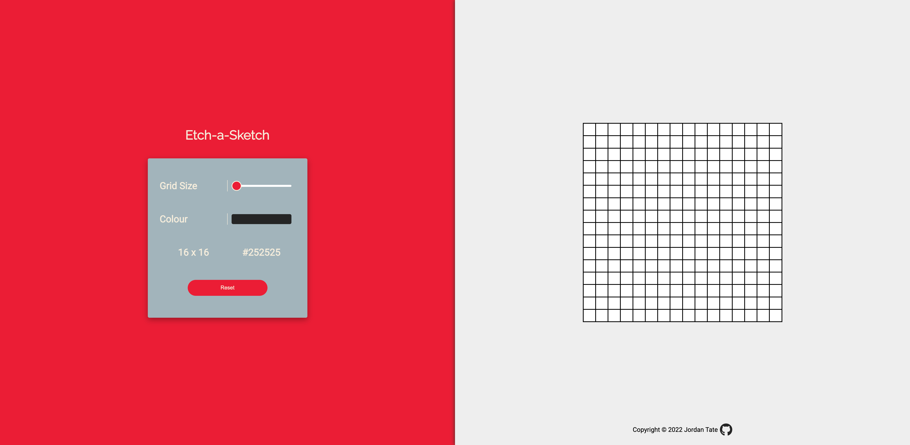

# Etch-a-Sketch | The Odin Project

Etch-a-Sketch game designed using Javascript in combination with HTML and CSS to create a simple UI with a function app. This project is for The Odin Project's *Foundation Path* and is meant to focus on my skills working with Javascript.

[View Page](https://jordantate.github.io/odin-etch-a-sketch/)

## Preview
